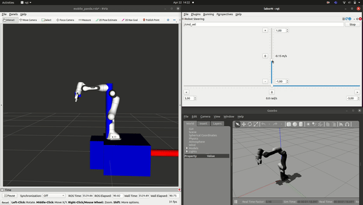

# Launch mobile panda controller

# For twist controller simulation

## pick and pass demo

# 1. Terminal
roslaunch mobile_panda_simulation mobile_panda_sim.launch

# 2. Terminal
roslaunch mobile_panda_controller_sim mobile_panda_controller_sim.launch controller:=twist_controller_sim

# 3. Terminal
rqt (robot stering to change position)

# For path controller simulation

# 1. Terminal
roslaunch mobile_panda_simulation mobile_panda_sim.launch

# 2. Terminal
roslaunch mobile_panda_controller_sim mobile_panda_controller_sim.launch controller:=path_controller_sim

# 3. Terminal
rqt (robot stering to change position)

# Rebuild workspace
cd /home/philipp/mobile_manipulation/mobile_manipulation_ws
catkin build -DCMAKE_BUILD_TYPE=Release -DFranka_DIR:PATH=/home/philipp/mobile_manipulation/libfranka/build