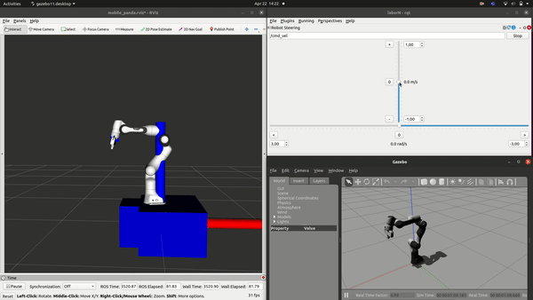
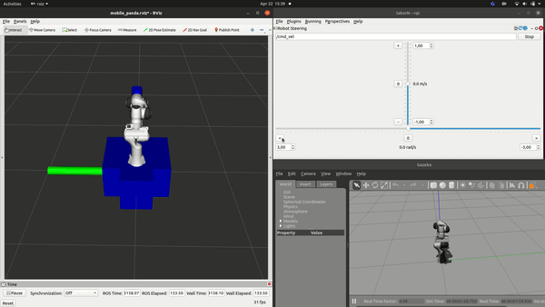
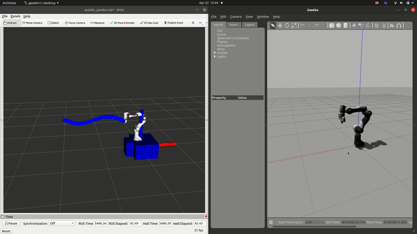
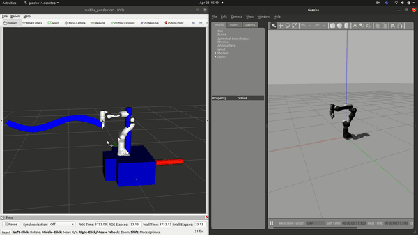

## Mobile Panda twist controller



## Start mobile pada twist controller
```bash
#start in three shells:

#shell a:
roslaunch mobile_panda_simulation mobile_panda_sim.launch

#shell b
roslaunch mobile_panda_controller_sim mobile_panda_controller_sim.launch controller:=twist_controller_sim

#shell c (only to move mobile base)
rqt

```

## Mobile Panda path controller without redudancy resolution


## Mobile Panda path controller with redudancy resolution (hold Robot near initial configuration)


## Start mobile pada path controller
```bash
#start in two shells:

#shell a:
roslaunch mobile_panda_simulation mobile_panda_sim.launch

#shell b
roslaunch mobile_panda_controller_sim mobile_panda_controller_sim.launch controller:=path_controller_sim

```

## Rebuild workspace
```bash
cd /home/philipp/mobile_manipulation/mobile_manipulation_ws
catkin build -DCMAKE_BUILD_TYPE=Release -DFranka_DIR:PATH=/home/philipp/mobile_manipulation/libfranka/build

```